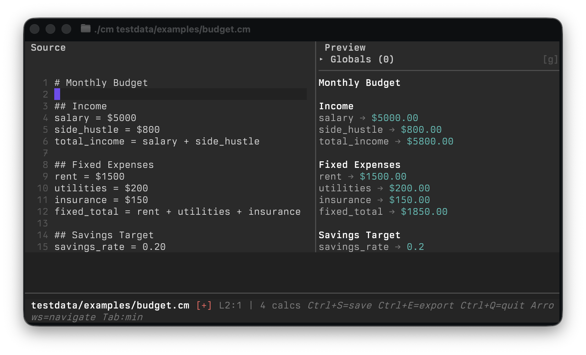

# CalcMark

**Calculations embedded in markdown documents.**


CalcMark is a terminal-based calculation notepad. Write your thinking in plain text, add calculations that reference each other, and watch results update as you type.

Unlike spreadsheets, CalcMark files are human-readable, diffable, and live in your terminal.

## Installation

**macOS/Linux (Homebrew):**

```bash
brew tap calcmark/tap https://github.com/CalcMark/homebrew-tap
brew install calcmark/tap/calcmark
```

**Download binary:**

| Platform | Download |
|----------|----------|
| macOS (Apple Silicon) | [calcmark_VERSION_darwin_arm64.tar.gz](https://github.com/CalcMark/go-calcmark/releases/latest) |
| macOS (Intel) | [calcmark_VERSION_darwin_amd64.tar.gz](https://github.com/CalcMark/go-calcmark/releases/latest) |
| Linux (x64) | [calcmark_VERSION_linux_amd64.tar.gz](https://github.com/CalcMark/go-calcmark/releases/latest) |
| Linux (arm64) | [calcmark_VERSION_linux_arm64.tar.gz](https://github.com/CalcMark/go-calcmark/releases/latest) |
| Windows (x64) | [calcmark_VERSION_windows_amd64.zip](https://github.com/CalcMark/go-calcmark/releases/latest) |

After downloading, extract and move `cm` to a directory in your PATH.

## Quick Start

1. Create a file called `budget.cm`:

```
# Monthly Budget

income = $5000
rent = $1500
savings_rate = 20%
savings = income * savings_rate
remaining = income - rent - savings
```

2. Open in the TUI editor:

```bash
cm budget.cm
```

3. Or evaluate from command line:

```bash
cm eval budget.cm
```

4. Or convert to other formats:

```bash
cm convert budget.cm --to=html -o budget.html
```



## Examples

Explore example files to see CalcMark in action:

- [Budget planning](testdata/examples/budget.cm) - Monthly budget with income, expenses, savings
- [Unit conversion](testdata/examples/unit-conversion.cm) - Converting between units
- [Capacity planning](testdata/examples/engineering.cm) - Engineering calculations with constants

Run any example:

```bash
cm testdata/examples/budget.cm
```

## Features

- **Variables flow downward** - Define once, reference anywhere below
- **Units are first-class** - `5 miles in km`, `20 celsius in fahrenheit`
- **Currencies** - `$100`, `50 EUR`, automatic formatting
- **Percentages** - `savings_rate = 20%`, then `income * savings_rate`
- **Functions** - `avg()`, `sqrt()`, `capacity()`, and more
- **YAML front matter** - Define document-level constants
- **Export formats** - Convert to HTML, Markdown, JSON, or plain text

## Help Commands

```bash
cm help              # General help
cm help functions    # List all functions with descriptions
cm help constants    # List built-in constants
cm convert --help    # Export format options
```

Press Ctrl+H (or F1) in the TUI editor for keybindings.

## Learn More

- [Documentation](https://calcmark.org/docs/) - Complete documentation with examples
- [Language Reference](https://calcmark.org/docs/language-reference/) - Formal language specification

## License

MIT
